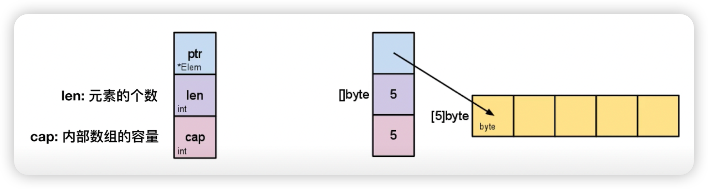
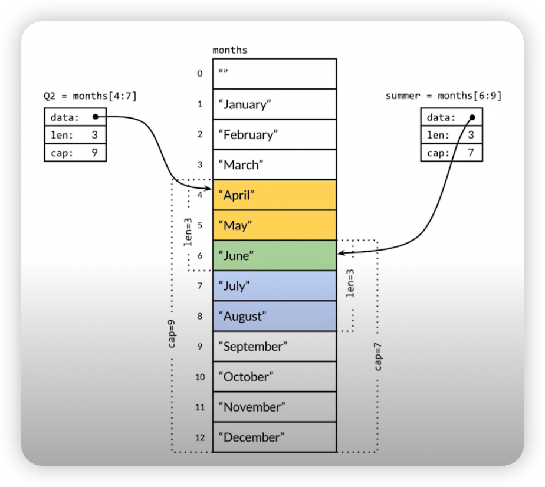

## 数组的声明

```go
// 数组的声明
var a [3]int //声明并初始化为默认零值
a[0] = 1

//声明同时初始化
b := [3]int{1, 2, 3}

//多维数组初始化
c := [2][2]int{{l, 2}, {3, 4}} 

// 与其他编程语言的差异
func TestTravelArray(t *testing.T) {
	a := [...]int{1, 2, 3, 4, 5}
	for idx /* 索引 */, elem/* 元素 */ := range a{
	    fmt.Println(idx, elem)	
    }
}
```

## 数组遍历

```go
// 与其他编程语言的差异
func TestTravelArray(t *testing.T) {
	a := [...]int{1, 2, 3, 4, 5}
	for idx /* 索引 */, elem/* 元素 */ := range a{
	    fmt.Println(idx, elem)	
    }
}
```

## 数组截取

```go
a [开始索引 (包含), 结束索引 (不包含)]
a := [...]int{1, 2, 3, 4, 5}
a[1:2] // 2
a[1:3] // 2,3
a[1:len(a)] // 2, 3, 4, 5
a[1:] // 2, 3, 4, 5
a[:3] // 1, 2, 3
```

## 切片

### 切片内部结构



### 切片共享存储结构



- [Show me the code](array_test.go)
- [Show me the code](slice_test.go)

## 数组 vs 切片

https://golang.design/go-questions/slice/vs-array/

slice 的底层数据是数组，slice 是对数组的封装，它描述一个数组的片段。两者都可以通过下标来访问单个元素。

数组是定长的，长度定义好之后，不能再更改。在 Go 中，数组是不常见的，因为其长度是类型的一部分，限制了它的表达能力，比如 [3]int 和 [4]int 就是不同的类型。

而切片则非常灵活，它可以动态地扩容。切片的类型和长度无关。

数组就是一片连续的内存， slice 实际上是一个结构体，包含三个字段：长度、容量、底层数组。

```go
// runtime/slice.go
type slice struct {
    array unsafe.Pointer // 元素指针
    len   int // 长度
    cap   int // 容量
}
```

1. 容量是否可伸缩
2. 是否可以进行比较
   
> 注意，底层数组是可以被多个 slice 同时指向的，因此对一个 slice 的元素进行操作是有可能影响到其他 slice 的。
>【引申1】 [3]int 和 [4]int 是同一个类型吗？
> 不是。因为数组的长度是类型的一部分，这是与 slice 不同的一点。

- [Show me the code](all_test.go)

### 切片扩容

https://golang.design/go-questions/slice/grow/

一般都是在向 slice 追加了元素之后，才会引起扩容。追加元素调用的是 append 函数。

先来看看 append 函数的原型：

```go
func append(slice []Type, elems ...Type) []Type
```

append 函数的参数长度可变，因此可以追加多个值到 slice 中，还可以用 ... 传入 slice，直接追加一个切片。

```go
slice = append(slice, elem1, elem2)
slice = append(slice, anotherSlice...)
```

append函数返回值是一个新的slice，Go编译器不允许调用了 append 函数后不使用返回值。

```go
append(slice, elem1, elem2)
append(slice, anotherSlice...)
```

所以上面的用法是错的，不能编译通过。

使用 append 可以向 slice 追加元素，实际上是往底层数组添加元素。但是底层数组的长度是固定的，如果索引 len-1 所指向的元素已经是底层数组的最后一个元素，就没法再添加了。

这时，slice 会迁移到新的内存位置，新底层数组的长度也会增加，这样就可以放置新增的元素。同时，为了应对未来可能再次发生的 append 操作，新的底层数组的长度，也就是新 slice 的容量是留了一定的 buffer 的。否则，每次添加元素的时候，都会发生迁移，成本太高。

新 slice 预留的 buffer 大小是有一定规律的。在golang1.18版本更新之前网上大多数的文章都是这样描述slice的扩容策略的：

> 当原 slice 容量小于 1024 的时候，新 slice 容量变成原来的 2 倍；原 slice 容量超过 1024，新 slice 容量变成原来的1.25倍。

在1.18版本更新之后，slice的扩容策略变为了：

> 当原slice容量(oldcap)小于256的时候，新slice(newcap)容量为原来的2倍；原slice容量超过256，新slice容量  `newcap = oldcap+(oldcap+3*256)/4`

为了说明上面的规律，我写了一小段玩具代码：

[code](./array_grow_test.go)

运行结果(1.18版本之前)：

```go
[0 ->   -1] cap = 0     |  after append 0     cap = 1   
[0 ->    0] cap = 1     |  after append 1     cap = 2   
[0 ->    1] cap = 2     |  after append 2     cap = 4   
[0 ->    3] cap = 4     |  after append 4     cap = 8   
[0 ->    7] cap = 8     |  after append 8     cap = 16  
[0 ->   15] cap = 16    |  after append 16    cap = 32  
[0 ->   31] cap = 32    |  after append 32    cap = 64  
[0 ->   63] cap = 64    |  after append 64    cap = 128 
[0 ->  127] cap = 128   |  after append 128   cap = 256 
[0 ->  255] cap = 256   |  after append 256   cap = 512 
[0 ->  511] cap = 512   |  after append 512   cap = 1024
[0 -> 1023] cap = 1024  |  after append 1024  cap = 1280
[0 -> 1279] cap = 1280  |  after append 1280  cap = 1696
[0 -> 1695] cap = 1696  |  after append 1696  cap = 2304
```

运行结果(1.18版本)：

```go
[0 ->   -1] cap = 0     |  after append 0     cap = 1
[0 ->    0] cap = 1     |  after append 1     cap = 2   
[0 ->    1] cap = 2     |  after append 2     cap = 4   
[0 ->    3] cap = 4     |  after append 4     cap = 8   
[0 ->    7] cap = 8     |  after append 8     cap = 16  
[0 ->   15] cap = 16    |  after append 16    cap = 32  
[0 ->   31] cap = 32    |  after append 32    cap = 64  
[0 ->   63] cap = 64    |  after append 64    cap = 128 
[0 ->  127] cap = 128   |  after append 128   cap = 256 
[0 ->  255] cap = 256   |  after append 256   cap = 512 
[0 ->  511] cap = 512   |  after append 512   cap = 848 
[0 ->  847] cap = 848   |  after append 848   cap = 1280
[0 -> 1279] cap = 1280  |  after append 1280  cap = 1792
[0 -> 1791] cap = 1792  |  after append 1792  cap = 2560
```

通过观察数据，发现不管是 1.18 之前的版本还是 1.18 版本，切片的扩容规则均不符合实际规则。即 在阈值之前均是翻倍，但是阈值之后的增长和规则不符。

难道现在网上各种文章中的扩容策略并不是正确的吗。我们直接搬出源码：源码面前，了无秘密。

向 slice 追加元素的时候，若容量不够，会调用 growslice 函数，所以我们直接看它的代码。

go 版本1.9.5

```go
// go 1.9.5 src/runtime/slice.go:82
func growslice(et *_type, old slice, cap int) slice {
    // ……
    newcap := old.cap
	doublecap := newcap + newcap
	if cap > doublecap {
		newcap = cap
	} else {
		if old.len < 1024 {
			newcap = doublecap
		} else {
			for newcap < cap {
				newcap += newcap / 4
			}
		}
	}
	// ……
	
	capmem = roundupsize(uintptr(newcap) * ptrSize)
	newcap = int(capmem / ptrSize)
}
```

go 版本1.18

```go
// go 1.18 src/runtime/slice.go:178
func growslice(et *_type, old slice, cap int) slice {
    // ……
    newcap := old.cap
	doublecap := newcap + newcap
	if cap > doublecap {
		newcap = cap
	} else {
		const threshold = 256
		if old.cap < threshold {
			newcap = doublecap
		} else {
			for 0 < newcap && newcap < cap {
                // Transition from growing 2x for small slices
				// to growing 1.25x for large slices. This formula
				// gives a smooth-ish transition between the two.
				newcap += (newcap + 3*threshold) / 4
			}
			if newcap <= 0 {
				newcap = cap
			}
		}
	}
	// ……
    
	// roundupsize函数就是处理内存对齐的函数。 ptrSize slice 中一个元素的大小
	capmem = roundupsize(uintptr(newcap) * ptrSize)
	newcap = int(capmem / ptrSize)
}
```

如果只看前半部分，现在网上各种文章里说的 newcap 的规律是对的。**现实是，后半部分还对 newcap 作了一个内存对齐**，这个和内存分配策略相关。进行内存对齐之后，新 slice 的容量是要 大于等于 按照前半部分生成的newcap。

之后，向 Go 内存管理器申请内存，将老 slice 中的数据复制过去，并且将 append 的元素添加到新的底层数组中。

最后，向 growslice 函数调用者返回一个新的 slice，这个 slice 的长度并没有变化，而容量却增大了。

---

【引申1】

关于 append，我们最后来看一个例子

```go
package main

import "fmt"

func main() {
	s := []int{1,2}
	s = append(s,4,5,6)
	fmt.Printf("len=%d, cap=%d",len(s),cap(s))
}

// output: len=5, cap=6
```

如果按网上各种文章中总结的那样：小于原 slice 长度小于 1024 的时候，容量每次增加 1 倍。添加元素 4 的时候，容量变为4；添加元素 5 的时候不变；添加元素 6 的时候容量增加 1 倍，变成 8。

这是错误的！我们来仔细看看，为什么会这样，再次搬出代码：

```go
// go 1.18 src/runtime/slice.go:178
// 这个函数的参数依次是 元素的类型，老的 slice，新 slice 最小求的容量。
func growslice(et *_type, old slice, cap int) slice {
    // ……
    newcap := old.cap
	doublecap := newcap + newcap
	if cap > doublecap {
		newcap = cap
	} else {
		const threshold = 256
		if old.cap < threshold {
			newcap = doublecap
		} else {
			for 0 < newcap && newcap < cap {
                // Transition from growing 2x for small slices
				// to growing 1.25x for large slices. This formula
				// gives a smooth-ish transition between the two.
				newcap += (newcap + 3*threshold) / 4
			}
			if newcap <= 0 {
				newcap = cap
			}
		}
	}
	// ……
    
	capmem = roundupsize(uintptr(newcap) * ptrSize)
	newcap = int(capmem / ptrSize)
}
```

例子中 s 原来只有 2 个元素，len 和 cap 都为 2，append 了三个元素后，长度变为 5，容量最小要变成 5，即调用 growslice 函数时，传入的第三个参数应该为 5。即 cap=5。而一方面，doublecap 是原 slice容量的 2 倍，等于 4。满足第一个 if 条件，所以 newcap 变成了 5。

接着调用了 roundupsize 函数，传入 40。（代码中ptrSize是指一个指针的大小，在64位机上是8）

接下来会进行内存对齐，详情可参考：https://golang.design/go-questions/slice/grow/


【引申2】 向一个nil的slice添加元素会发生什么？为什么？

其实 nil slice 或者 empty slice 都是可以通过调用 append 函数来获得底层数组的扩容。最终都是调用 mallocgc 来向 Go 的内存管理器申请到一块内存，然后再赋给原来的nil slice 或 empty slice，然后摇身一变，成为“真正”的 slice 了。