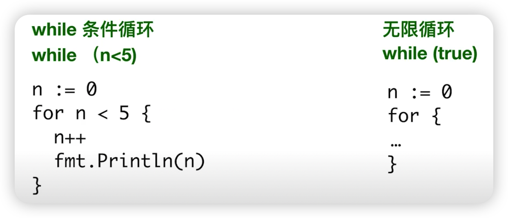
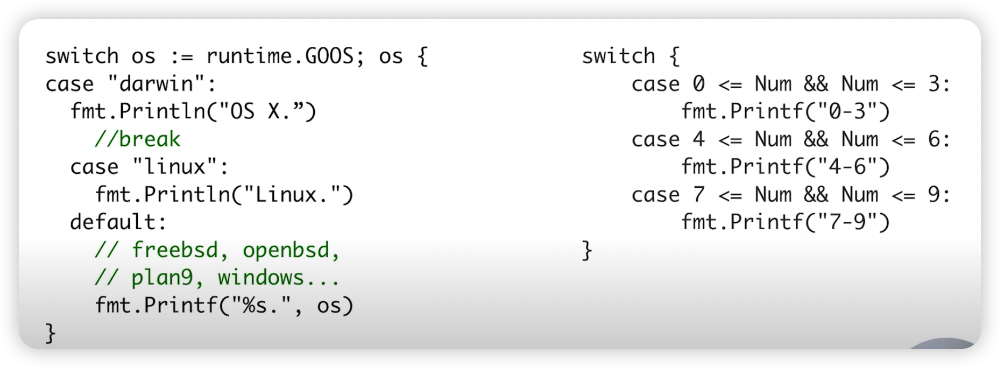

## 循环

与其他主要编程语言的差异

Go 语言仅支持循环关键字 for



## 条件

```go
// if 条件判断
package main

if condition {
	// code to be executed if condition is true
} else {
	// code to be executed if condition is false
}

if condition-1 {
	code to be executed if condition-1 is true
} else if condition-2 {
	code to be executed if condition-2 is true
} else {
	code to be executed if both codition-1 and condition-2 are false
}

/*
 注意：
 condition 表达式结果必须为 布尔值
 支持变量赋值
*/
if var declaration; condition {
 */
	code to be executed if condition is true
}
```

## Switch 条件

与其他主要编程语言的差异

1. 条件表达式不限制为常量或者整数；
2. 单个 case 中，可以出现多个结果选项，使用逗号分隔；
3. 与C语言等规则相反，Go 语言不需要用break来明确退出一个 case；
4. 可以不设定 switch 之后的条件表达式，在此种情况下，整个 switch 结构与多个计...else.…的逻辑作用等同



- [Show me the code](condition_test.go)
- [Show me the code](loop_test.go)
