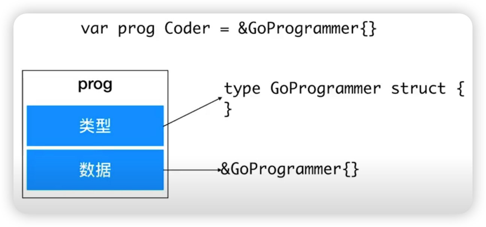

## 接口

- 接口是非侵入性的，实现不依赖与接口定义
- 所以接口的定义可以包含在接口使用者包内

Duck Type 式接口实现

```go
// 接口定义
type Programmer interface {
	WriteHelloWorld() Code
}

// 接口实现
type GoProgrammer struct {}

func (p *GoProgrammer) WriterHelloWorld() Code {
    return "fmt.Println("Hello World")"
}
```

### 接口变量




### 自定义类型

[]()

