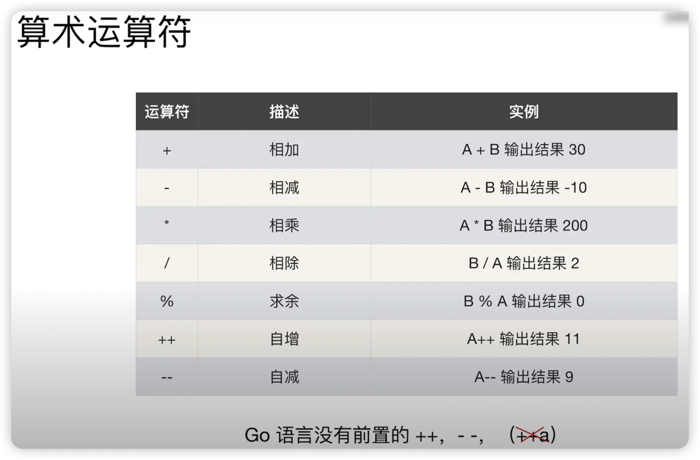
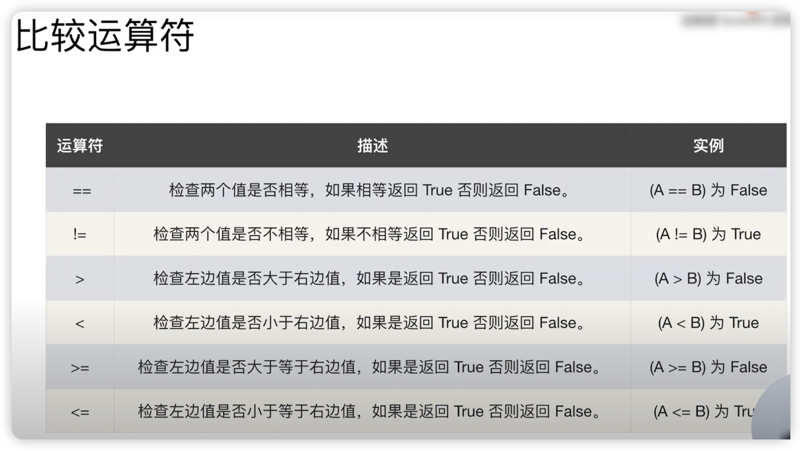
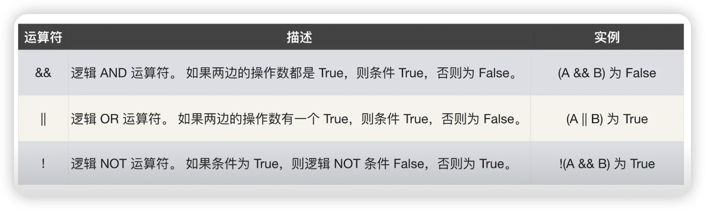
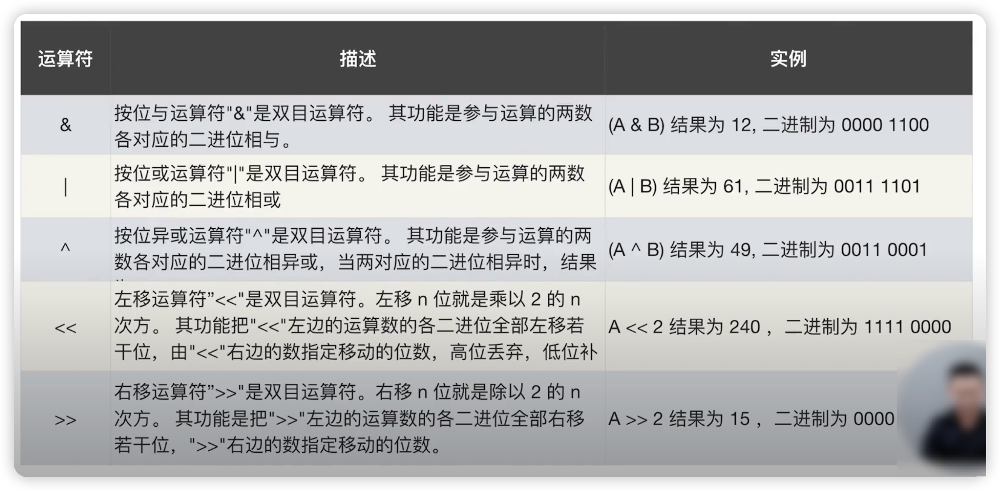

## 运算符

### 算术运算符

### 比较运算符

用 `==` 比较数组

• 相同维数且含有相同个数元素的数组才可以比较
• 每个元素都相同的才相等

### 逻辑运算符

### 位运算符

与其他主要编程语言的差异

**&^ 按位置零**

1 &^ 0 -- 1
0 &^ 0 -- 0

1 &^ 1 -- 0
0 &^ 1 -- 0

[Show me the code](operator_test.go)