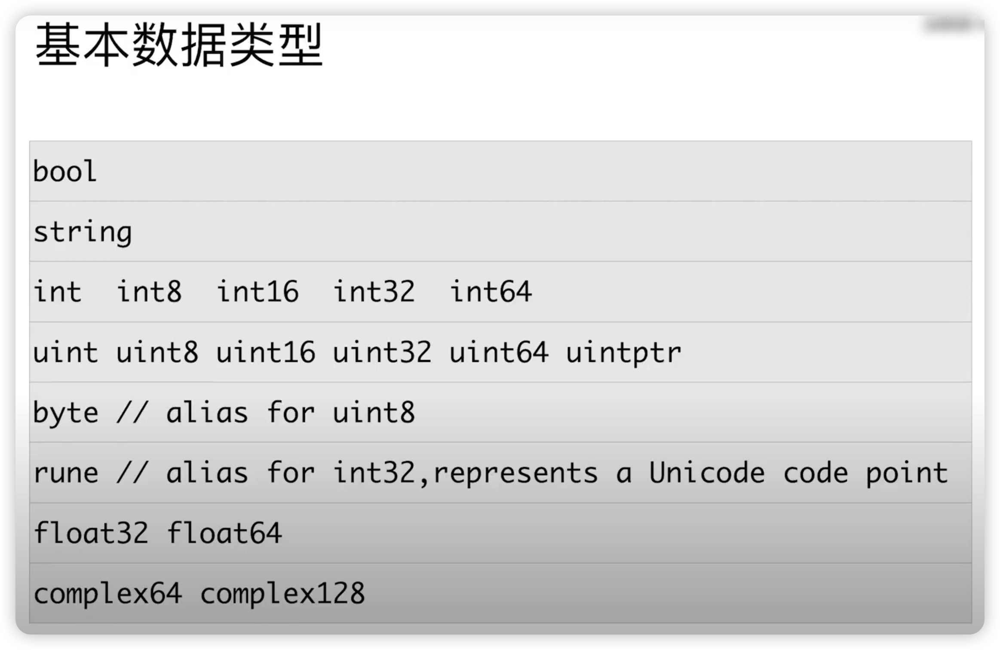

## 数据类型

### 基本数据类型

类型转化 ,与其他主要编程语言的差异

1. Go 语言不允许隐式类型转换
2. 别名和原有类型也不能进行隐式类型转换

**类型的预定义值**

1. math.MaxInt64
2. math.MaxFloat64
3. math. MaxUint32

**指针类型**

与其他主要编程语言的差异

1. 不支持指针运算
2. string 是值类型，其默认的初始化值为空字符串，而不是 nil

[Show me the code](type_test.go)
